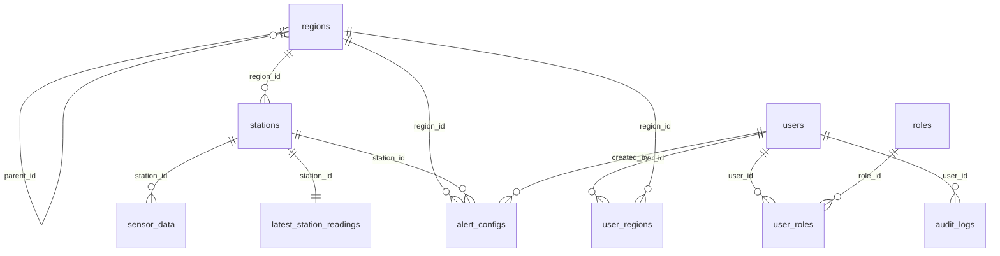

# Database Export - 2026-09-06

Export này phản ánh thiết kế database hiện tại trong repo, lấy từ `db/init/001_schema.sql` và `db/init/002_seed_data.sql`.

Lưu ý: tôi không dump được live database vì môi trường hiện tại không có `psql` và Docker socket trả `permission denied`. Vì vậy export này là source-of-truth SQL dùng để khởi tạo DB mới.

## Files

- `schema.sql`: schema chính, extensions, tables, indexes, Timescale hypertable, continuous aggregates, seed tối thiểu.
- `seed_data.sql`: seed dữ liệu demo lớn hơn, gồm region bổ sung, 2,000 trạm giả lập và dữ liệu sensor 24 giờ.

## Extensions

- `timescaledb`: dùng cho hypertable `sensor_data` và continuous aggregates.
- `pgcrypto`: dùng để hash mật khẩu admin seed bằng `crypt(...)`.

## ERD Rút Gọn

## Bảng Chính

| Table | Vai trò |
| --- | --- |
| `roles` | Danh mục vai trò hệ thống: `super_admin`, `manager`, `viewer`. |
| `regions` | Cây vùng địa lý; station và user đều gắn vào region. |
| `users` | Tài khoản đăng nhập, trạng thái, role legacy dạng text. |
| `user_roles` | Quan hệ nhiều-nhiều giữa user và role. |
| `user_regions` | Phạm vi dữ liệu user được đọc/quản lý theo region. |
| `stations` | Metadata trạm quan trắc, tọa độ, status, region, `last_seen_at`. |
| `sensor_data` | Dữ liệu time-series raw, hypertable TimescaleDB, khóa chính `(station_id, time)`. |
| `latest_station_readings` | Snapshot mới nhất cho dashboard/map realtime. |
| `alert_configs` | Ngưỡng cảnh báo theo station hoặc region. |
| `audit_logs` | Nhật ký hành động người dùng. |

## Time-Series Design

`sensor_data` là hypertable với chunk interval 1 ngày:

- Raw resolution: `1m` từ `sensor_data`.
- Hourly resolution: `1h` từ continuous aggregate `sensor_data_hourly`.
- Daily resolution: `1d` từ continuous aggregate `sensor_data_daily`.

Continuous aggregates:

| View | Bucket | Metrics | Extra fields |
| --- | --- | --- | --- |
| `sensor_data_hourly` | 1 hour | avg `temperature`, `humidity`, `wind_speed`, `pm25` | `samples` |
| `sensor_data_daily` | 1 day | avg `temperature`, `humidity`, `wind_speed`, `pm25` | `samples`, `valid_hours` |

Refresh policies:

- `sensor_data_hourly`: refresh từ 3 ngày trước tới cách hiện tại 5 phút, mỗi 15 phút.
- `sensor_data_daily`: refresh từ 90 ngày trước tới cách hiện tại 1 giờ, mỗi 1 giờ.

## Indexes

Các index chính:

- `idx_sensor_data_time` trên `sensor_data(time DESC)`.
- `idx_sensor_data_station_time` trên `sensor_data(station_id, time DESC)`.
- `idx_sensor_data_hourly_station_bucket` trên `sensor_data_hourly(station_id, bucket DESC)`.
- `idx_sensor_data_daily_station_bucket` trên `sensor_data_daily(station_id, bucket DESC)`.
- `idx_stations_region`, `idx_stations_last_seen`.
- Partial index cho `alert_configs.station_id` và `alert_configs.region_id`.
- `idx_audit_logs_entity` cho tra cứu audit theo entity.

## Seed Data

`schema.sql` seed tối thiểu:

- 3 roles.
- 2 regions: `VN-HN`, `VN-HCM`.
- 2 stations: `HN001`, `HCM001`.
- 1 admin user: `admin / admin@123`.
- Region access cho admin trên toàn bộ regions.
- Alert config mặc định cho `pm25`, `temperature`, `humidity`.

`seed_data.sql` seed demo:

- Thêm 3 regions: `VN-DN`, `VN-CT`, `VN-HP`.
- Tạo 2,000 stations mã `ENV-0001` tới `ENV-2000`.
- Tạo 24 điểm sensor cho mỗi station, tổng khoảng 48,000 raw rows.
- Cập nhật `latest_station_readings`.
- Refresh `sensor_data_hourly` và `sensor_data_daily`.

## API Query Implication

Thiết kế mới sau merge dùng các tầng dữ liệu này để tránh trả quá nhiều điểm lên chart:

- Khoảng ngắn dùng raw `sensor_data`.
- Khoảng dài tự nâng resolution sang hourly hoặc daily.
- API trả envelope `{ meta, points }` với `effective_resolution`, `max_points`, `returned_points`, `downsampled`.
- Khi downsample từ aggregate views, average được tính có trọng số theo `samples`.

